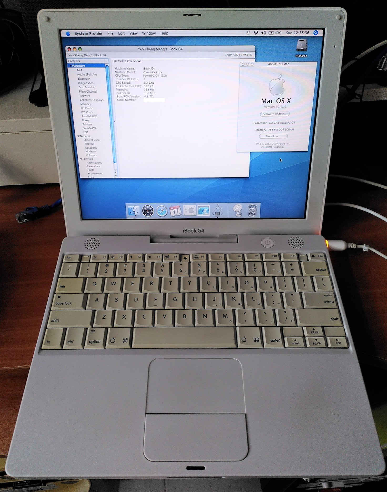
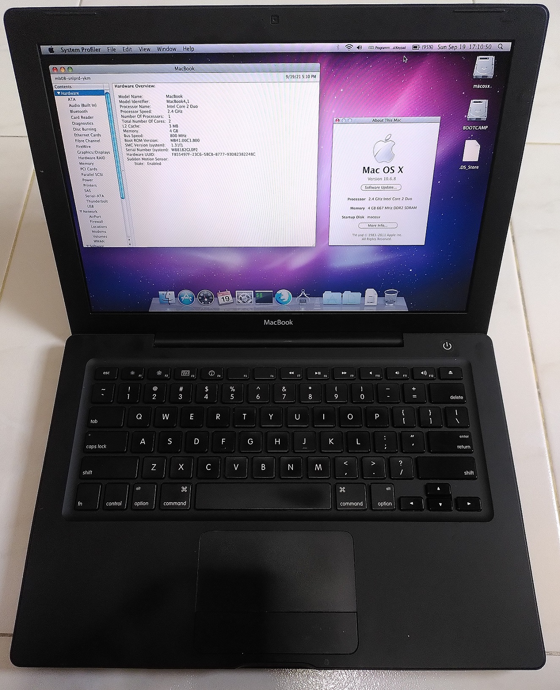

# retro-configs-apple
Collection of my setup configurations and instructions of my retro Apple machines.

# 1. [Power Mac G4 (Mirrored Drive Doors FW800)](powermac-g4-mdd-p58) (2003)


This is a desktop Mac released in 2003. This model is unfortunately the first one of this series that cannot boot natively into the Mac OS 9. 

If OS 9 has to be used, it can only be officially done though the Classic environment abstraction layer.

However native OS 9.2.2 booting can still be done with some workarounds.

I will install both Mac OS 9.2.2 and OS X 10.4 Tiger on this system as a dual boot configuration.

# 2. [PowerBook G4 A1025 (Titanium)](powerbook-g4-titanium-a1025) (2002)


This laptop was released in Nov 2002 and is the last of the PowerBook G4 line that can natively boot into Mac OS 9.

This guide will be about installing both Mac OS 9.2.2 and OS X 10.4 Tiger on this system as a dual boot configuration.

# 3. [12" iBook G4](ibook-g4-a1054) (Late 2004)



This laptop was released in Oct 2004. It cannot natively boot from Mac OS 9.

This guide will be about installing both OS X 10.4 Tiger and Classic Mode on this system.

# 4. [Macbook (Early 2008)](macbook-2008)



This Macbook was released in early 2004. This black version is relatively uncommon and cost more then.

This machine is installed with 10.6 Snow Leopard and Windows 10 32-bit Bootcamp.

## Common Software

### Mac OS X System optimisation

Not directly related to this guide but could be tangentially relevant.

1. Show hidden files in Finder

```bash
defaults write com.apple.Finder AppleShowAllFiles true
killall Finder
```

2. Install the last versions of some apps for Tiger OS

* [TenFourFox](https://www.floodgap.com/software/tenfourfox/): One of the last updated browsers for OS 10.4
* [Iterm1](http://iterm.sourceforge.net/): To replace the default Terminal
* [VLC 0.9.10](https://www.videolan.org/vlc/download-macosx.html): Media player
* [iStat Menus](https://macintoshgarden.org/apps/istat-menus): Display live system stats
