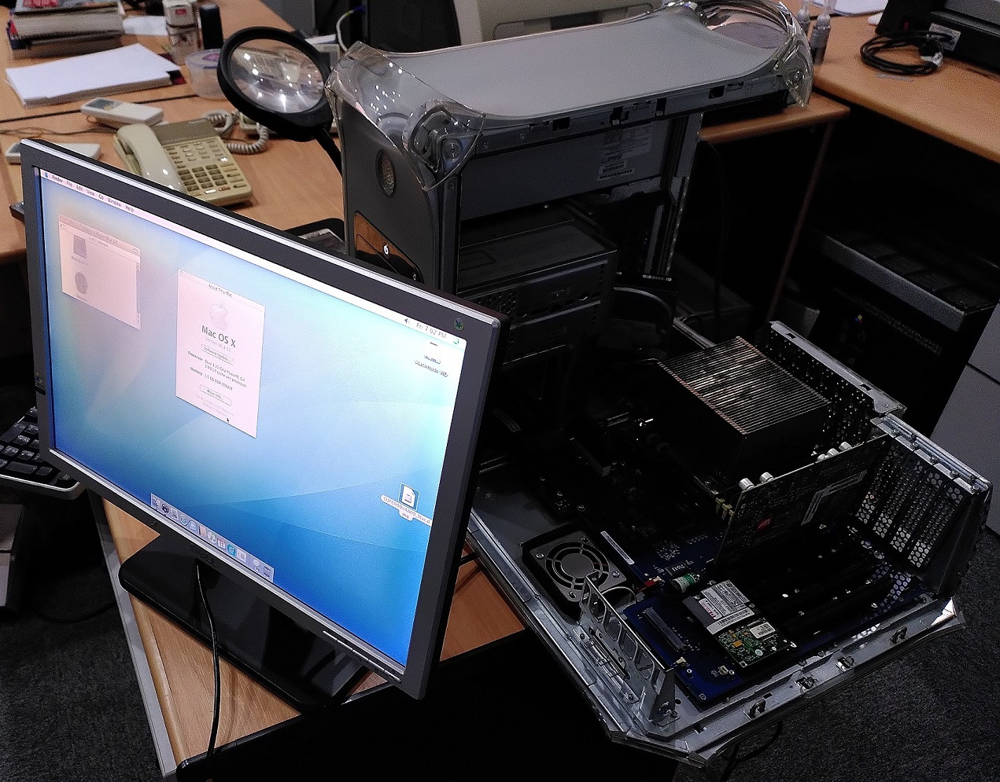
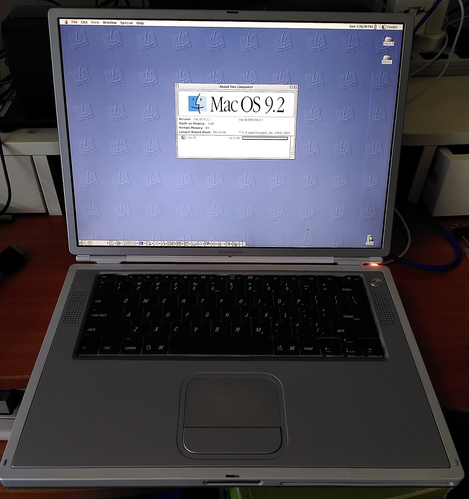

# retro-configs-apple
Collection of my setup configurations and instructions of my retro Apple machines.

# 1. [Power Mac G4 (Mirrored Drive Doors FW800)](powermac-g4-mdd-p58) (2003)

This is a desktop Mac released in 2003. This model is unfortunately the first one of this series that cannot boot natively into the Mac OS 9. 

If OS 9 has to be used, it can only be officially done though the Classic environment abstraction layer.

However native OS 9.2.2 booting can still be done with some workarounds.

I will install both Mac OS 9.2.2 and OS X 10.4 Tiger on this system as a dual boot configuration.

# 2. [PowerBook G4 A1025 (Titanium)](powerbook-g4-titanium-a1025) (2003)

This laptop was released in Nov 2002 and is the last of the PowerBook G4 line that can natively boot into Mac OS 9.

This guide will be about installing both Mac OS 9.2.2 and OS X 10.4 Tiger on this system as a dual boot configuration.
