# Apple II Plus (1979)

This is one of the earliest Apple machines. The Apple II Plus was the second generation Apple II computer and was released in 1979.

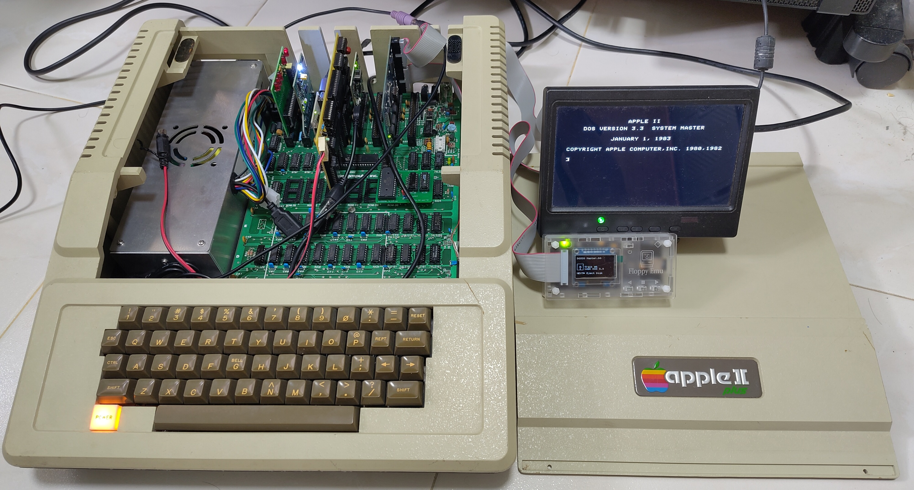

AppleDOS 3.3 loaded from Floppy Emu.

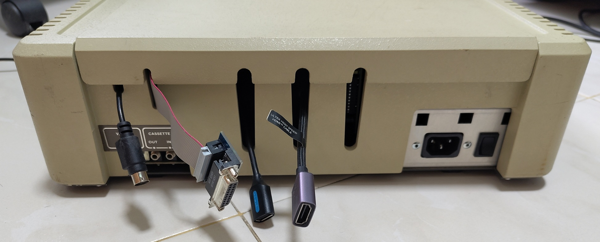

Back of the machine containing extension cables for PS/2, Floppy, USB mouse and HDMI.

## Hardware

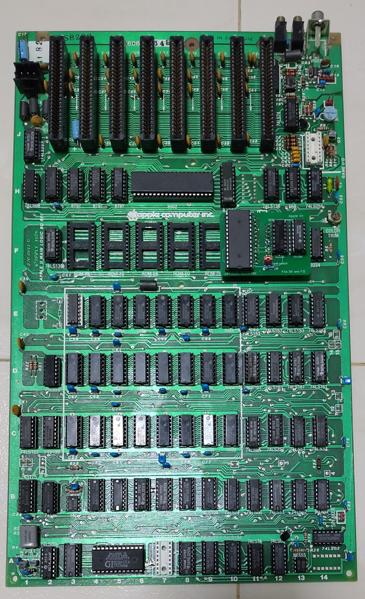

A relatively recent Apple II Plus 820-0044-D motherboard with ROMs replaced.

* 1Mhz MOS Technology 6502
* 48 KB RAM on motherboard

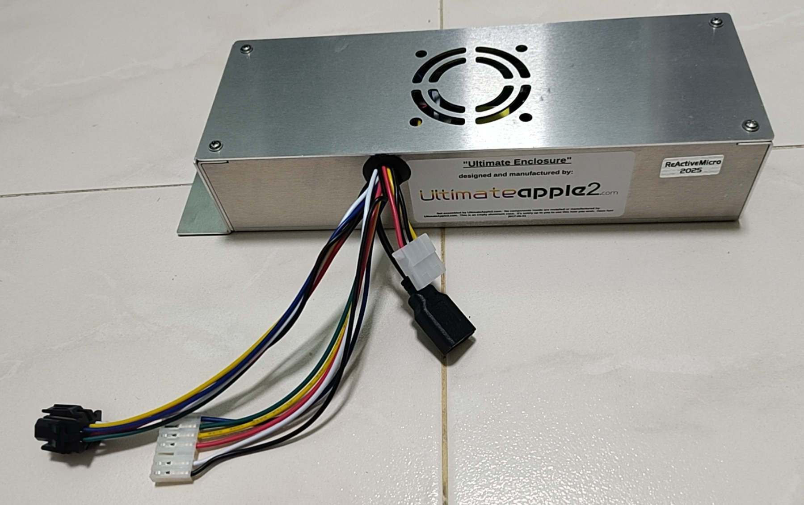

[Reactive Micro Universal PSU Kit](https://www.reactivemicro.com/product/universal-psu-kit/) as the previous PSU was dead.

### Expansion cards

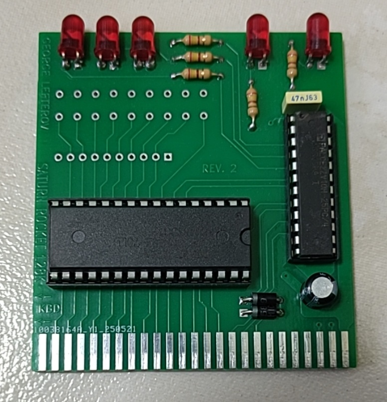

Apple II Saturn Rocket 128K RAM used as 16K expansion card. Obtained from [here](https://www.tindie.com/products/retro_devices/apple-2-ii-plus-e-iie-2e-saturn-rocket-128k-ram/).

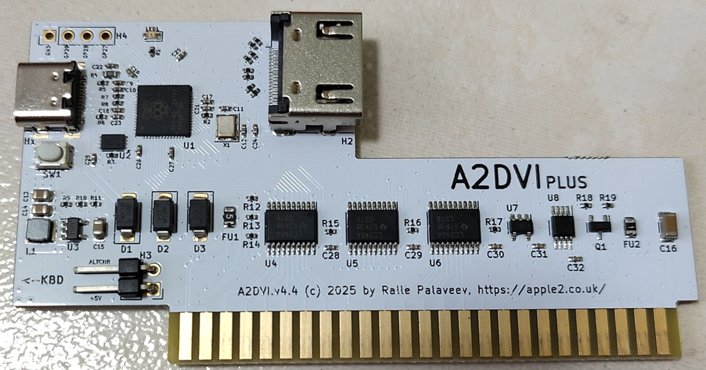

Apple II DVI Plus to enable use with modern HDMI monitor. This card also supports the 80-column text mode.

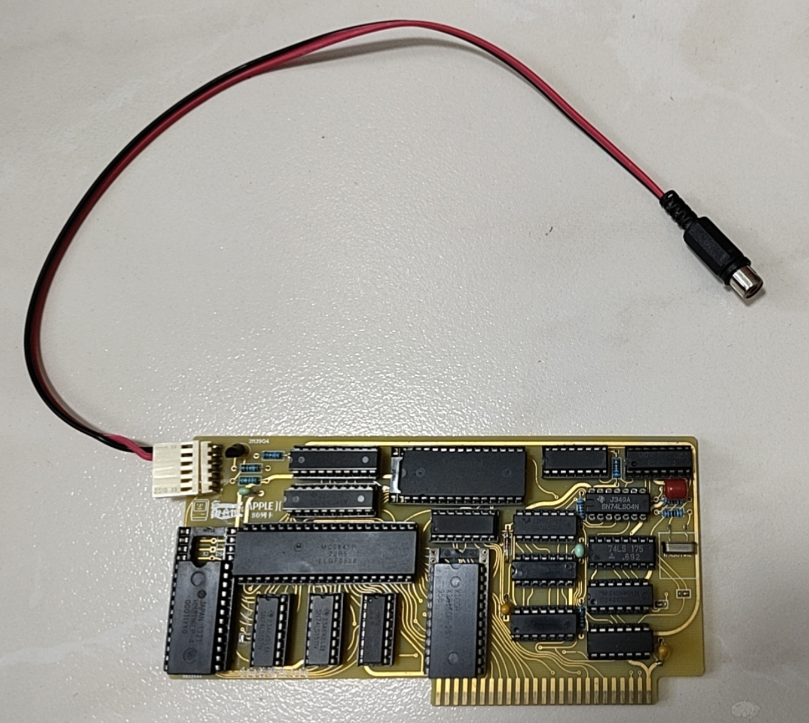

A remake of the 80-column text mode card. Obtained from [here](https://www.tindie.com/products/denjhang/apple-ii-80-column-text-card-enig-gold-edition/).

The composite out is unused as the A2DVI will display the output instead.

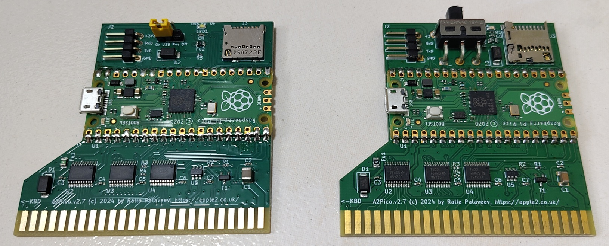

A2Pico multi-function cards used to load an Appli-Card firmware (Z80-CPU) and mouse interface.

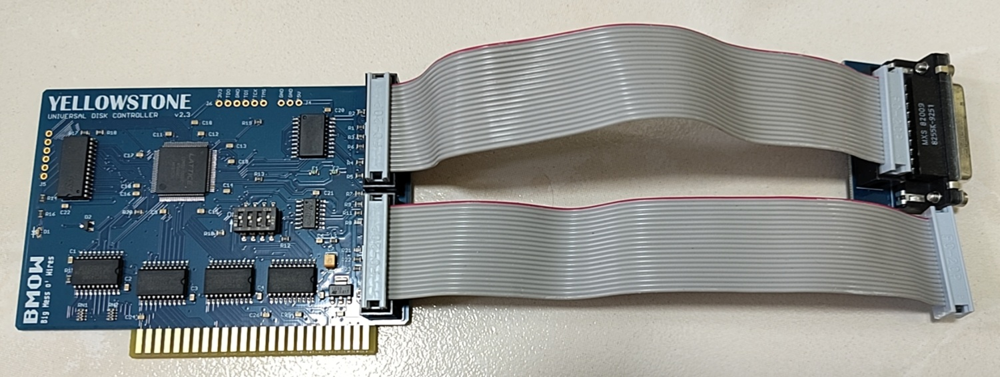

Yellowstone universal disk controller card.

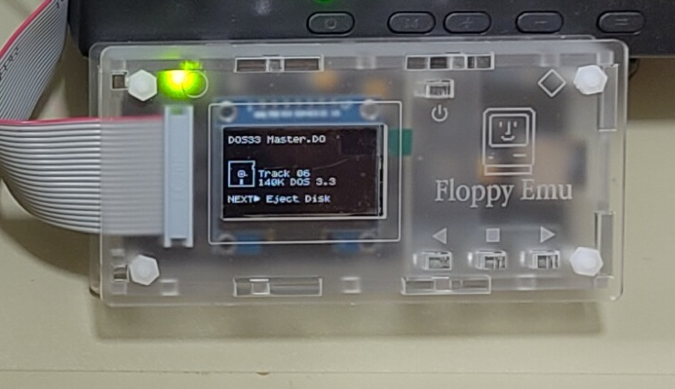

Floppy Emu paired with the Universal Disk Controller to dynamically load floppy disk images.

## Repairs and Augmentation

### ROM replacement

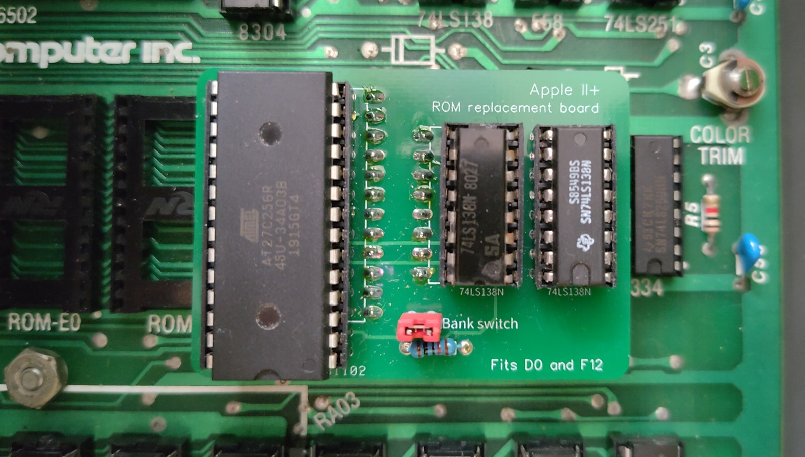

As some ROMs were faulty, I replaced all of them with a modern solution. Purchased from [Ebay](https://www.ebay.com.sg/itm/127478828464).

Complete [ROM replacement](https://www.blue-print.be/product-manuals/Manual-apple-ii-rom-replacement.pdf) solution in combination with [Apple II Deadtest](https://github.com/misterblack1/appleII_deadtest).

### Power LED

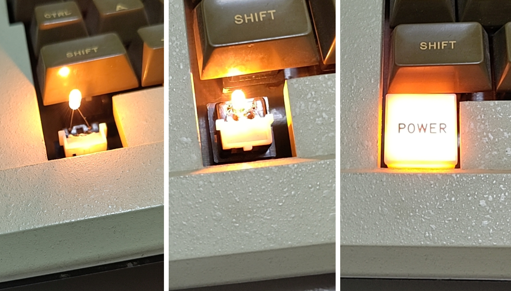

As the previous power LED on the keyboard was not working, I replaced it with a new one of part VCC 683.

### Keyboard PS/2 controller and splitter

The original keyboard had many failed keys. Instead of time-consuming efforts to fix it, I decided to use a [PS/2 keyboard converter](https://www.tindie.com/products/denjhang/apple-ii-ps2-keyboard-converter/).

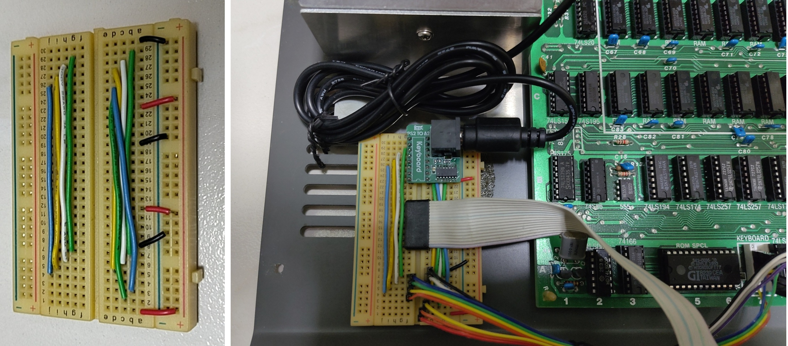

The PS/2 keyboard converter was however too tall to be installed directly on the motherboard as the clearance between the keyboard and the motherboard is too tight. Hence it has to be installed elsewhere. I also want to retain the use of the original power LED on the keyboard.

I used a breadboard to combine the signals PS/2 controller and Power LED of the original keyboard.

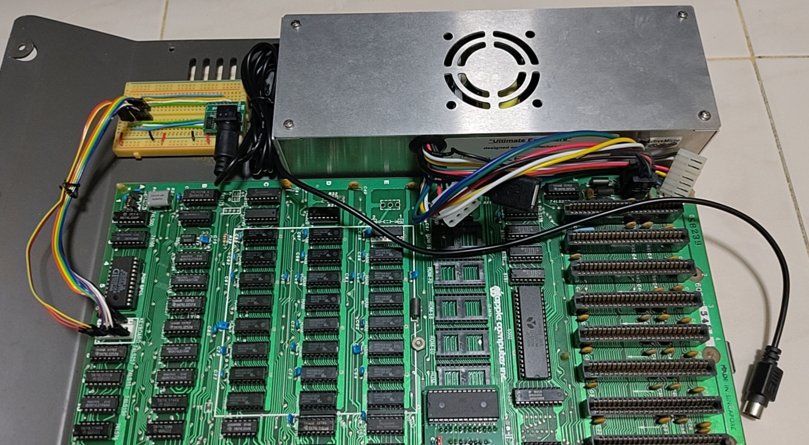

A PS/2 extension cable is used to bring out the keyboard connector to the back of the case.

### Additional Faults

After some effort in fault diagnosis, I found the following issues:

* MOS 6502
* 4116 RAM
* Signetics 8T97 replaced with 74LS367

Keyboard with these unfixed issues: 1,*,a,sticky g,c,sticky m, intermittent spacebar

## Alternate F8 Dual ROM

As part of my debugging, I also purchased an alternate F8 Dual ROM from [Ebay](https://www.ebay.com.sg/itm/257015108404).

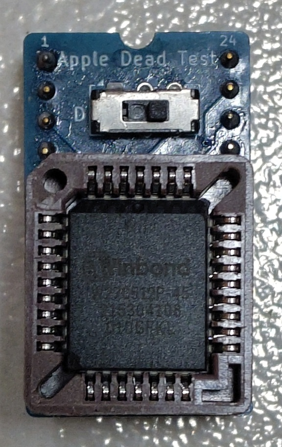

This F8 replacement contains the original F8 ROM as well as [Apple II Deadtest](https://github.com/misterblack1/appleII_deadtest).

As the original F8 ROM of this product was meant for the original Apple II, I had to replace it with the F8 ROM meant for the Apple II Plus.

These are the commands to generate the replacement ROM image.

```bash
dd if=/dev/zero bs=1 count=65536 2>/dev/null | tr '\000' '\377' > combo_27c512.bin
dd if=apple2dead.bin of=combo_27c512.bin bs=1 seek=0 conv=notrunc 2>/dev/null
dd if=F8_341-0020.bin of=combo_27c512.bin bs=1 seek=$((0x800)) conv=notrunc 2>/dev/null
```

## References and sources

1. [PCPI disk images](https://mirrors.apple2.org.za/Apple%20II%20Documentation%20Project/Interface%20Cards/Z80%20Cards/PCPI%20Appli-Card/)
2. [Apple II diagnostic disks](https://mirrors.apple2.org.za/ftp.apple.asimov.net/images/disk_utils/diagnostics/)
3. [Mousepaint](https://archive.org/details/mousepaintdrawingprogram_6800239a)
4. [Prodos 2.4.3](https://prodos8.com/releases/prodos-243/)
5. [Floppy Emu firmware](https://www.bigmessowires.com/floppy-emu/)
6. [Apple II deadtest](https://github.com/misterblack1/appleII_deadtest)
7. [Apple II Plus ROMs](https://mirrors.apple2.org.za/Apple%20II%20Documentation%20Project/Computers/Apple%20II/Apple%20II%20plus/ROM%20Images/)
8. [A2Pico Appli-Card 2024-03-02](https://github.com/oliverschmidt/appli-card)
9. [A2Pico Mouse Interface 2025-11-21](https://github.com/oliverschmidt/mouse-interface)
10. [Keyboard pinout](https://knzl.at/ps2-keyboard-for-apple-ii/)
11. [Apple II Plus IC chart](https://www.apple2faq.com/apple2faq/apple-ii-plus-motherboard-ic-cart/)