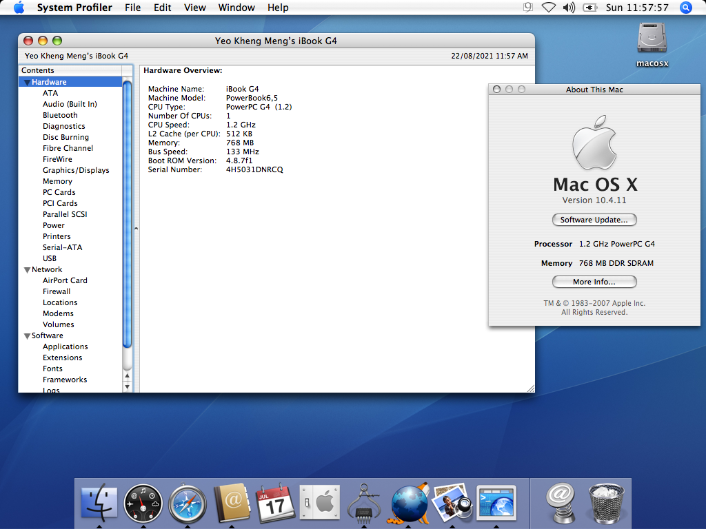
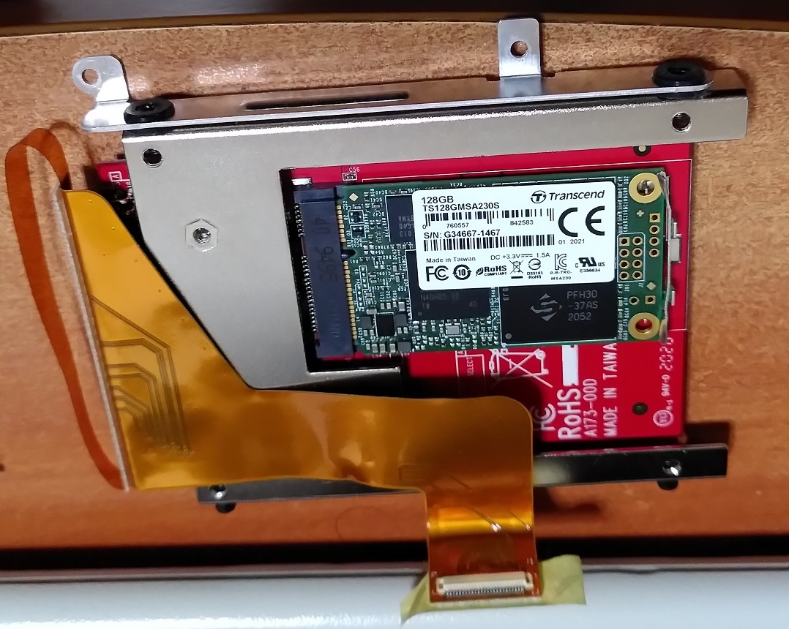
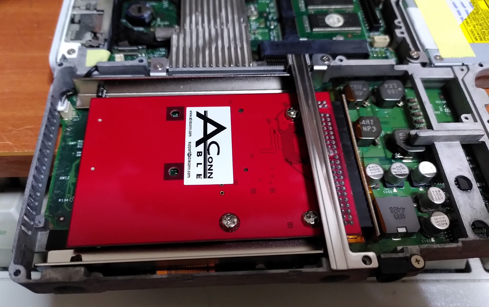
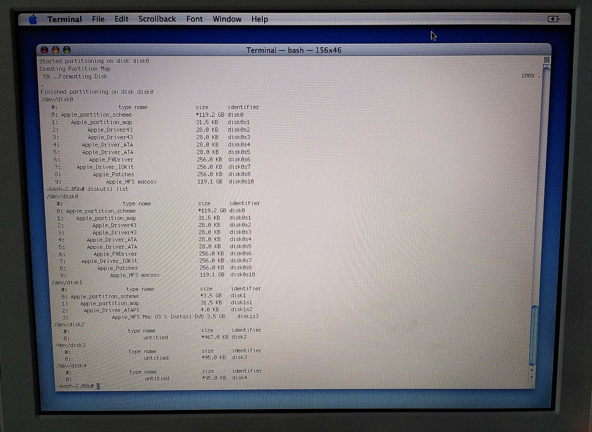
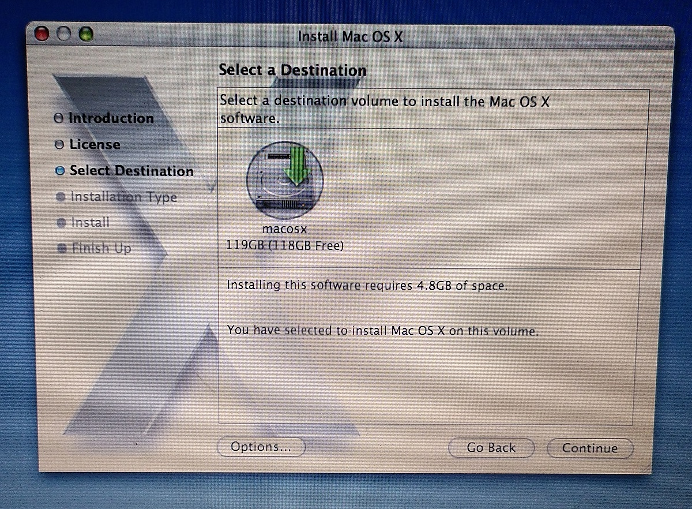
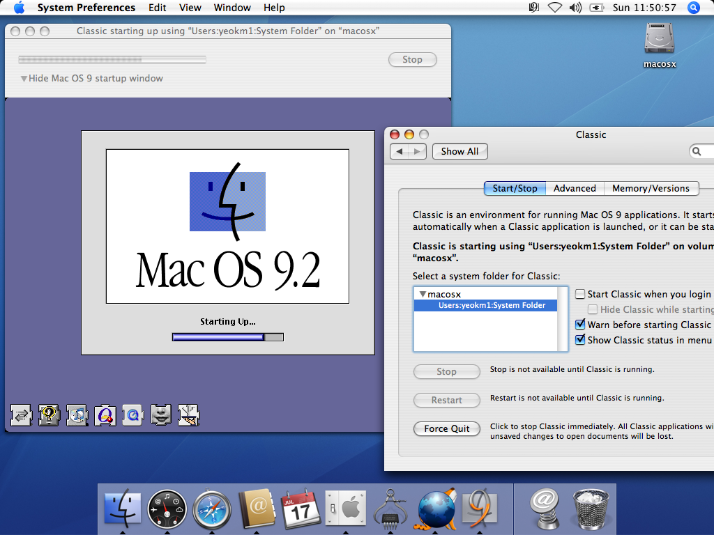

# 12" iBook G4 (Late 2004)

This laptop was released in Oct 2004. It cannot natively boot from Mac OS 9.

This guide will be about installing both OS X 10.4 Tiger and Classic Mode on this system.


## Hardware

* CPU: Single-core 1.2 GHz PowerPC G4
* Graphics: ATI Mobility Radeon 9200 with 32 MB of DDR SDRAM
* RAM: 256MB built-in + 512MB DDR PC2700 SODIMM
* Screen: 12" 1024x768



### Storage Drive



I swapped the existing HDD to a 128GB Transcend MSA230S mSATA SSD for better reliability.



The drive is mounted into a mSATA-IDE adapter then inserted into the laptop.

Changing this hard drive is [considered difficult by iFixit](https://www.ifixit.com/Guide/iBook+G4+12-Inch+800+MHz-1.2+GHz+Hard+Drive+Replacement/166) due to the many steps of disassembly required.

## OS Images

### Mac OS X Tiger 10.4

I opted to use the 10.4.6 DVD image over the 4-CD version to reduce the hassle of reinserting discs.

After installation, the OS can be updated to 10.4.11 as Apple's update servers are still active.

https://macintoshgarden.org/apps/mac-osx-mac-os-10-ppc

## Installation

Here are the high level steps I used to install both operating systems.

1. Boot from Tiger OS disk and partition disk
2. Complete Tiger OS installation and all updates
3. Mac OS 9 Classic Environment in OS X

### Mac OS X 10.4 Tiger

#### 1. Boot from Tiger OS disk and partition disk



```bash
diskutil list

diskutil partitionDisk /dev/disk0 1 OS9Drivers JHFS+ macosx 119.2G
```

I want to have the disk be compatible with Mac OS 9 in case I want to use that in future. Since this laptop does not natively support that native OS 9 booting, Disk Utility does not give the option to have the disk support OS Drivers. This has to be done from command line.

#### 2. Complete Tiger OS installation and all updates



There is only one disk to select.

#### 3. Mac OS 9 Classic Environment in OS X

The Mac OS 9 System and Application folders have to be copied from the `Mac OS 9.2.2 Universal Install` ISO's internal restore image file `MacOS9Lives.img` to any place of your choosing.



After that run the `Classic` applet from `System Preferences`. Configure the applet to the location of the OS 9 system files then start it.