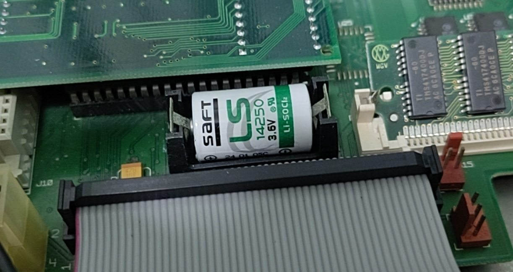

# Mac LC 3 (1993)

This is a pizza-boxed size desktop Mac released in 1993.

## Hardware 

* 25 MHz 68030 CPU
* 36MB: 4MB onboard + 32 MB SIMM-72
* 16GB microSD storage via BlueSCSI to SD v1.0-c

### Network

Farallon PDS Ethernet card

## Adapters

To interface with modern peripherals, I get some adapters.

ADB-USB Wombat to enable USB mouse/keyboard to be used. Purchased from [here](https://www.bigmessowires.com/usb-wombat/).

DB15-VGA adapter set to appropriate settings.

## OS

This is running System 7.5.3 premade system image. Download file is HD0-OpenRetroSCSI-7.5.3.hda.zip obtained from [here](https://mega.nz/folder/8hA3AQCJ#pWUq92L70yDXlogy9lk5Dg).

## Hardware Repairs

The original unit was extremely dusty and could not be powered on.

Before.

After making some repairs and part replacements.

### Re-cap

All the electrolytic capacitors on the motherboard was replaced as they were bulging or leaking.

Special care was observed for this 3 capacitors as C22 was soldering incorrectly.

According to this [site](https://www.downtowndougbrown.com/2024/11/the-capacitor-that-apple-soldered-incorrectly-at-the-factory/), the polarity of C22 is wrongly marked on the silkscreen and also soldered on incorrectly. This is an issue for the Mac LC III motherboards.

When replacing with a modern capacitor, ignore the polarity that is printed on the motherboard's silkscreen.

### Power Supply Unit (PSU)

The original PSU never worked so I opted to replace its electronics outright.

The original PSU.

I fabricated and assembled the [mAcTX_LC](https://github.com/akuker/mAcTX_LC) to allow me to power the LCIII with conventional ATX PSU.

Installing everything including PicoPSU inside the original PSU enclosure.

Packing everything back in.

### Battery

Replaced the Saft LS14250 PRAM battery.

### Heatsink

Heatsinks were added to main ICs to extend longevity.

### Testing during the repair process

I did intermediate testing as I was replacing the components to ensure everything still worked.

