# Macbook (Early 2008)

This Macbook was released in early 2008. This black version is relatively uncommon and cost more then.


This machine can support up to Mac OS X 10.7 Lion however I opted to go with the older 10.6 Snow Leopard as it has the Rosetta emulator. I also installed Windows 10 32-bit Bootcamp for the "complete experience".

## Hardware

* CPU: Intel Core 2 Duo T8300 2.4Ghz
* Graphics: Intel 965 Express
* RAM: 2x2GB DDR2 667 MHz PC2-5300
* Screen: 13.3-inch glossy LCD, 1280×800
* DVD-RW
* 240GB Intel 330 SSD
* Broadcom 802.11n Wifi

## OS installation

OS X installation goes first.

### Snow Leopard

#### Producing OS X install medium

I got the 10.6.3 DMG from the page on [Macintosh Garden Snow Leopard](https://macintoshgarden.org/apps/apple-osx-snow-leopard) page. It's not the latest but the OS can be updated later after installation.

I plan to install from a USB flash drive hence this DVD image has to be properly written to it.

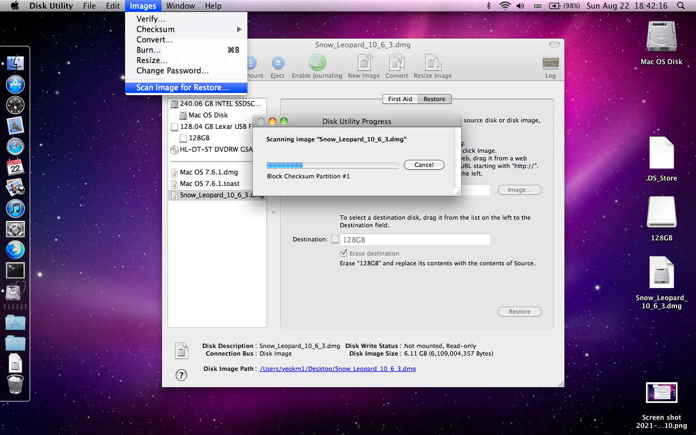

It seems we have to use the `Scan Image for Restore` in Disk Utility first. This function does not work on newer Mac OS X versions for this DMG though, something from that era is required.

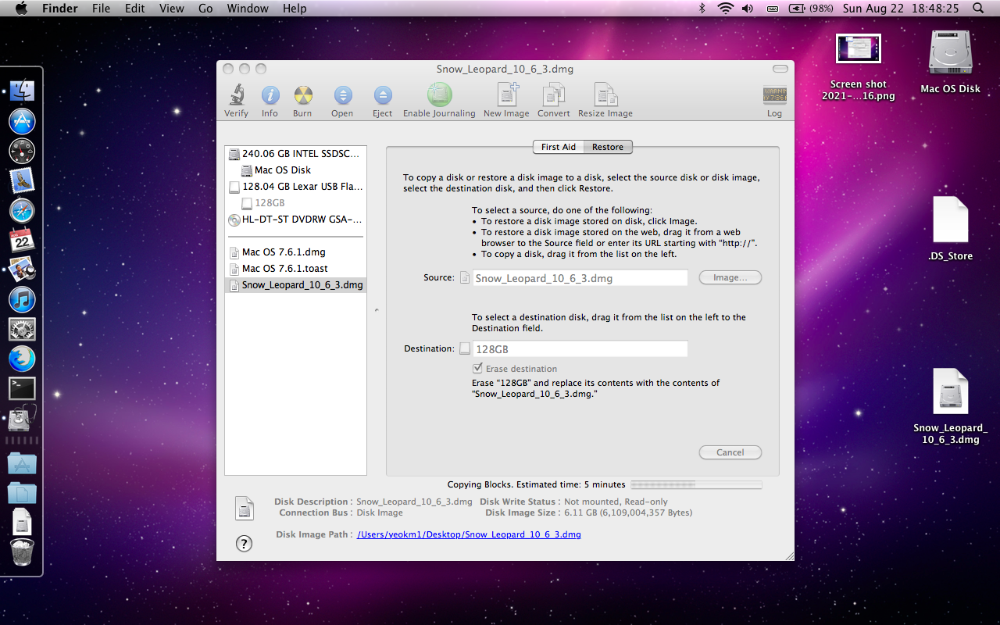

Then start writing to the USB flash drive.

#### Installing Snow Leopard

Reboot the machine and press the `Option` key on start. Select the USB flash drive to boot from it.

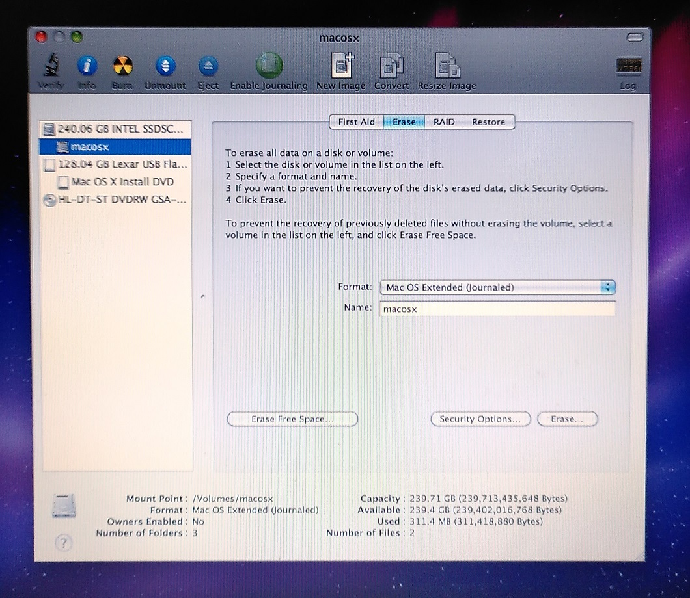

Go to Disk Utility to create a partition for the entire disk.

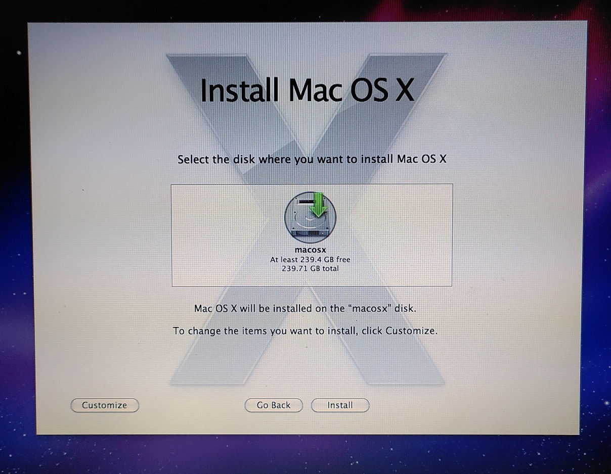

Select that partition to install to.

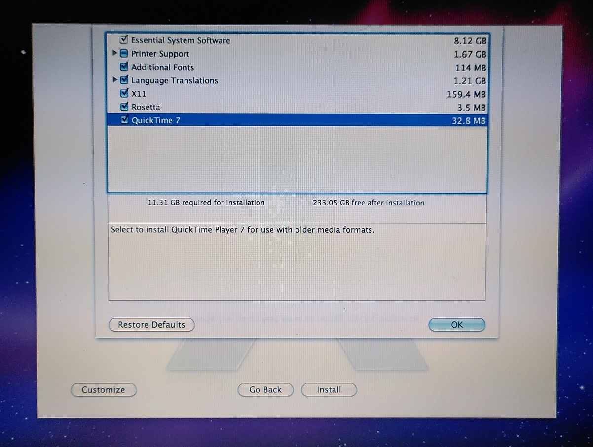

I opted to customise the installation to add other optional components.


The fresh post-install will look cleaner than this but this is an idea what it should like.

#### Useful Snow Leopard programs

* [Trim Enabler 2.2](https://macintoshgarden.org/apps/trim-enabler): To allow SSD TRIM on third-party SSDs which is pretty much everything we use today
* [Macports](https://www.macports.org/install.php): A modern package manager that still works on Snow Leopard however it compiles packages from source hence it requires Xcode.
* [Xcode 4.2 for Snow Leopard](https://download.developer.apple.com/Developer_Tools/xcode_4.2_for_snow_leopard/xcode_4.2_for_snow_leopard.dmg): It's the latest Xcode for Snow Leopard. Requires login to Apple Developer site.
* [Iterm](http://iterm.sourceforge.net/): A relatively modern Terminal replacement

### Preparing to install Windows 10 32 bit

Windows 10 32-bit was chosen as the Bootcamp drivers were meant for Windows 7 32-bit only. 

The has it's own dedicated step as the prep work for installing Windows 10 is more complicated than just using a bootable USB flash drive.

>Many early 64 bit Intel Mac models contained firmware which prevented BIOS booting from 64 bit Windows installer DVDs. Here, I will assume your Mac is one such model. The latest 32 bit Windows 10 installer DVDs also can not be booted on these model Macs. 
>
>Source: https://itectec.com/askdifferent/macbook-installing-windows-on-a-macbook-pro-15-inch-core-2-duo-without-mac-os-x/

To workaround this problem, I decided to install the Windows OS to the Macbook via Target Disk Mode through Virtualbox on another Mac.

#### Install Refind

The [Refind boot loader](https://www.rodsbooks.com/refind/installing.html) should be installed to allow ease of selecting Windows to boot later.

#### Bootcamp configuration

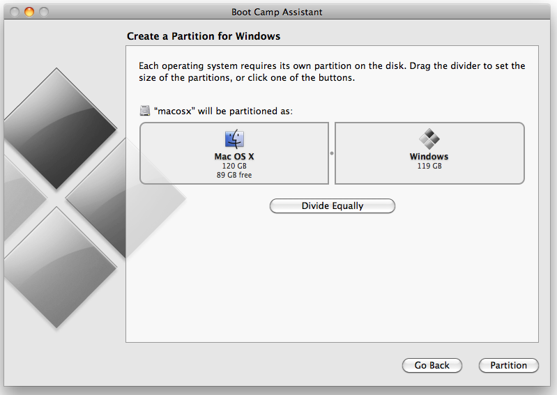

I opt to run the Bootcamp configuration to help me partition the disk. Bootcamp behind-the-scenes will setup the disk to use a GPT-MBR hybrid partition system so Windows will boot using BIOS instead of EFI.

Typically, one would prefer to use EFI-boot to start Windows however since there is an EFI-boot issue for Windows 10 on this older Mac, I'll stick to the conventional MBR-BIOS boot.

#### Connecting the 2 machines

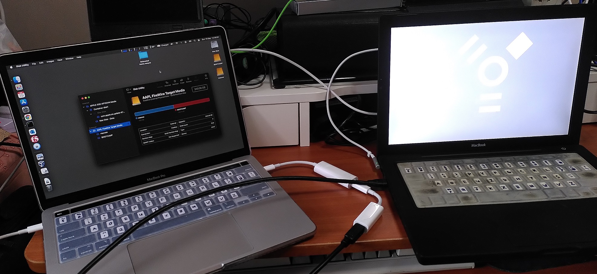

Equipment I used:
* Modern Mac
* Apple Thunderbolt 3 (USB-C) to Thunderbolt 2 Adapter
* Apple Thunderbolt to FireWire 800 Adapter
* Firewire 800 to Firewire 400 cable

On boot, press the `T` key for the Macbook 2008 to enter Target Disk Mode and its drive partitions will now be visible to the modern Mac.

We have to verify that the disk is mounted properly on the modern Mac.

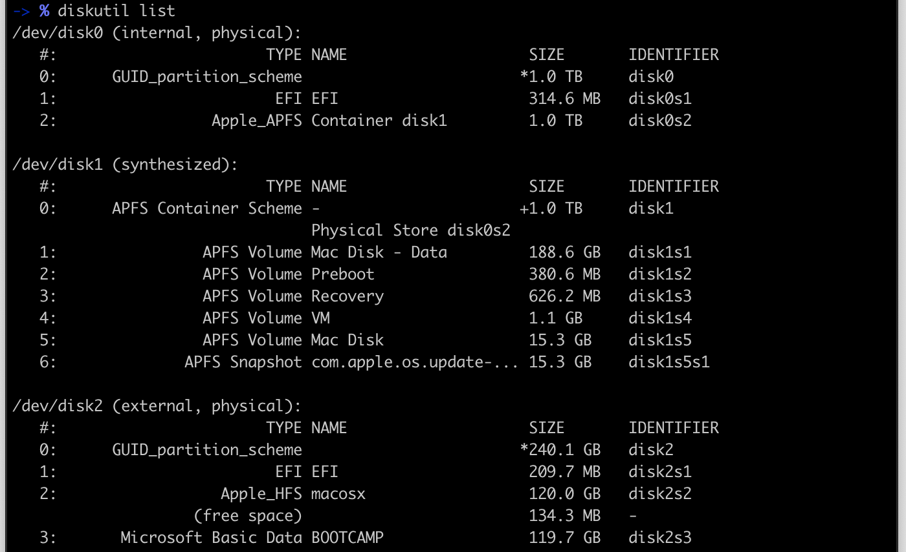

Run `diskutil list` to verify that the external disk is mounted and name of the disk in this case is `/dev/disk2`.

#### Configure Virtualbox

Here I'll setup Virtualbox on a modern Mac to try to install Windows 10 on the disk of the Macbook.

First we have to map the the disk to a virtual disk file.

```bash
# Unmount disk and set permissions so we can use the disk as a normal user
diskutil umountDisk /dev/disk2
sudo chmod 775 /dev/disk2
sudo chown yourusername /dev/disk2

# Map disk to a virtual disk file
sudo VBoxManage internalcommands createrawvmdk -filename "windows.vmdk" -rawdisk /dev/disk2

# Configure permissions again
diskutil umountDisk /dev/disk2
sudo chmod 775 /dev/disk2
sudo chown yourusername /dev/disk2

sudo chmod 775 ~/windows.vmdk
sudo chown yourusername ~/windows.vmdk
```

We have to repeatedly unmount and change the permissions as it will revert back to default every time we use it.

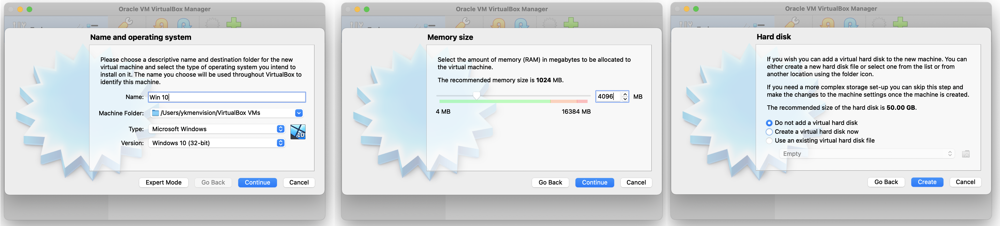

Configure the system parameters to use Windows 10 32 bit.

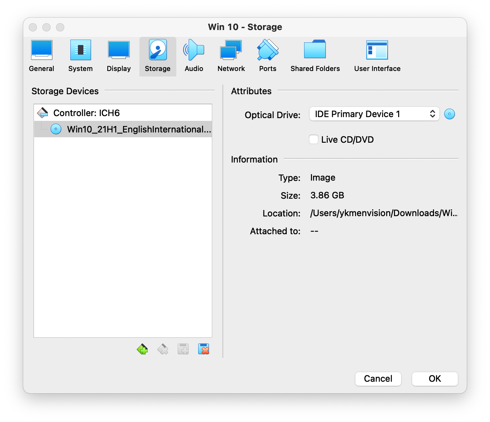

Add an IDE drive loaded with Windows 10 ISO.

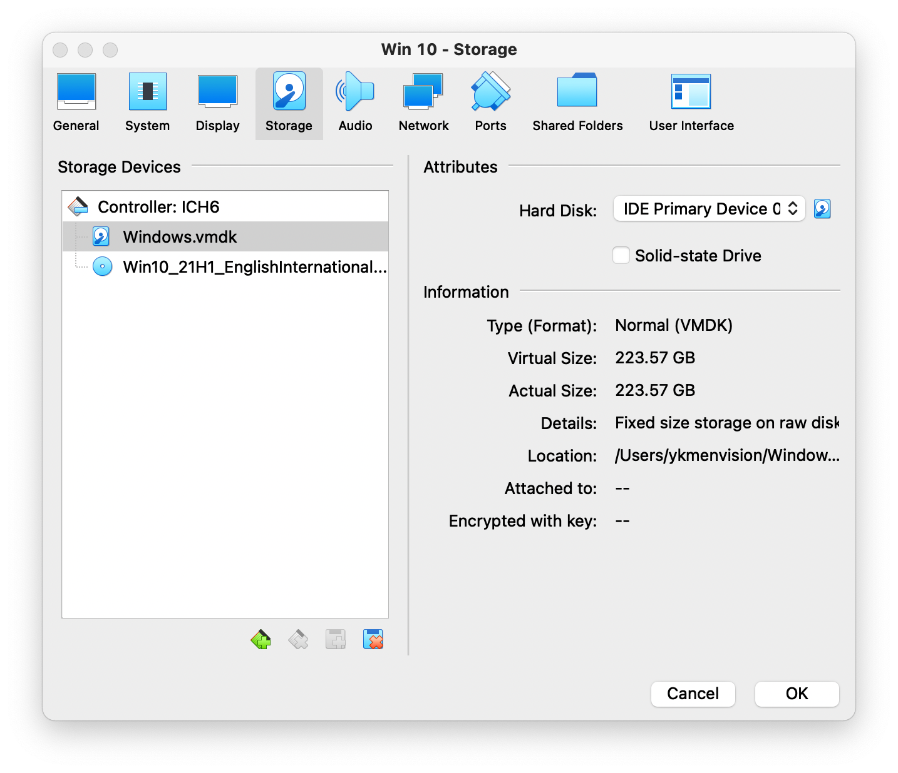

Add the virtual disk file as a hard disk.

Adjust the permissions again.

```bash
# Unmount disk and set permissions so we can use the disk as a normal user
diskutil umountDisk /dev/disk2
sudo chmod 775 /dev/disk2
sudo chown yourusername /dev/disk2
sudo chmod 775 ~/windows.vmdk
sudo chown yourusername ~/windows.vmdk
```

#### Windows

Start the Virtual machine and let it boot.

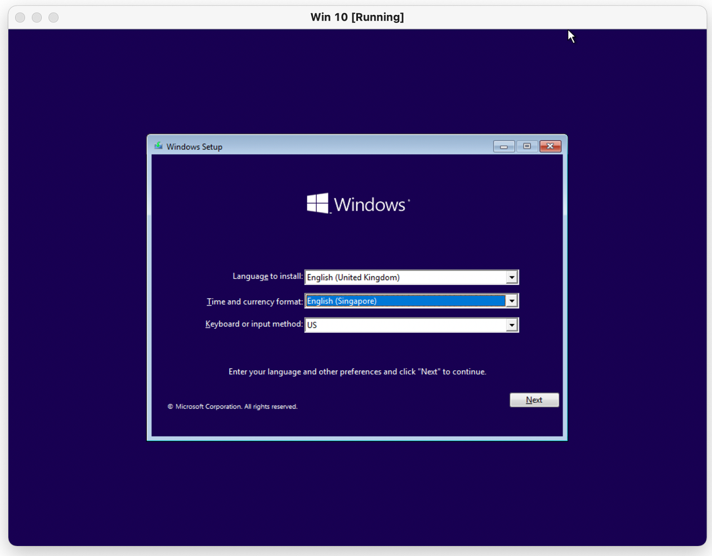

Since this is a VM and the disk access has to go through a relatively slow FW400 cable, it will take a while to load.


Format the Bootcamp partition with NTFS.

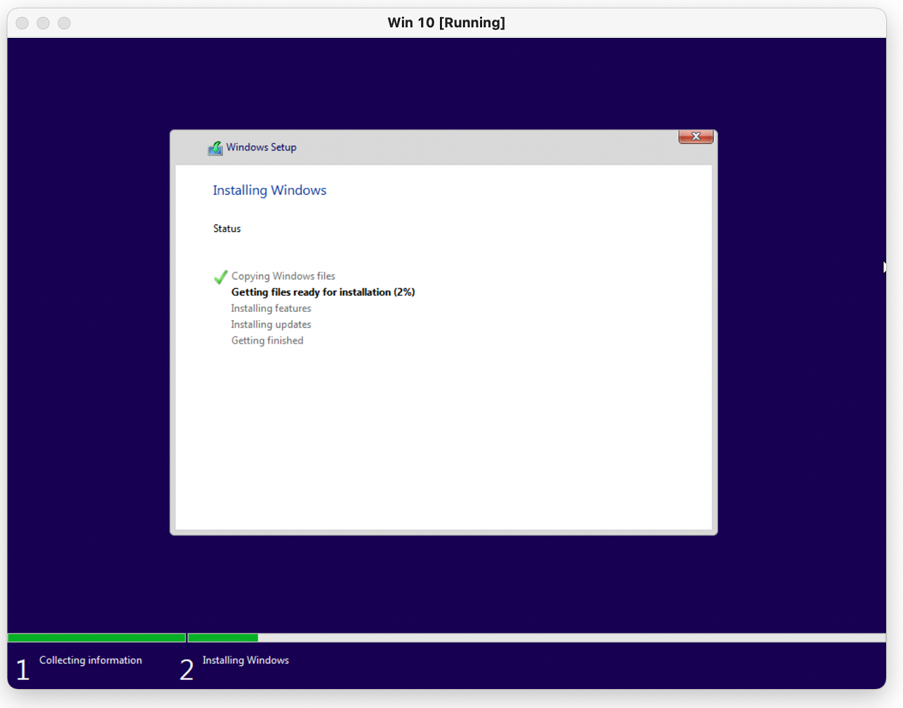

This process can take a long time due to slow disk access. **Do not let the system enter standby.** This will cause the external disk to be unmounted thus failing the install.

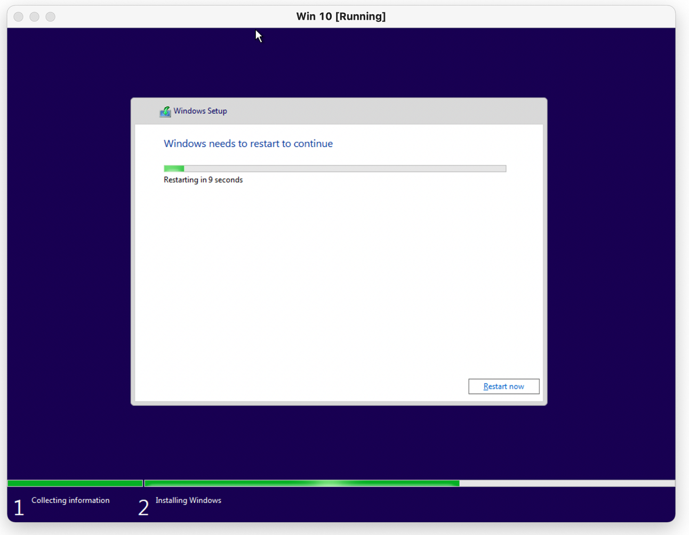

Do be alert on this ready to restart step. **Power off the VM and do not let the system restart again**

Disconnect the Firewire cable and reboot the Macbook.

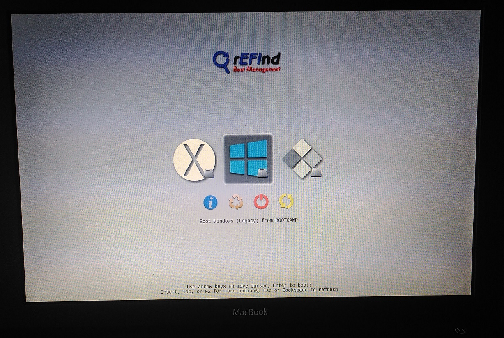

Upon startup, the Refind bootloader will show the Windows option. Select it to continue the installation.

Once you reach the end of the installation. Download and install the [Bootcamp 4.0.4033 drivers](https://support.apple.com/kb/DL1630).

These drivers are meant for Windows 7 but they will work in Compatibility Mode.

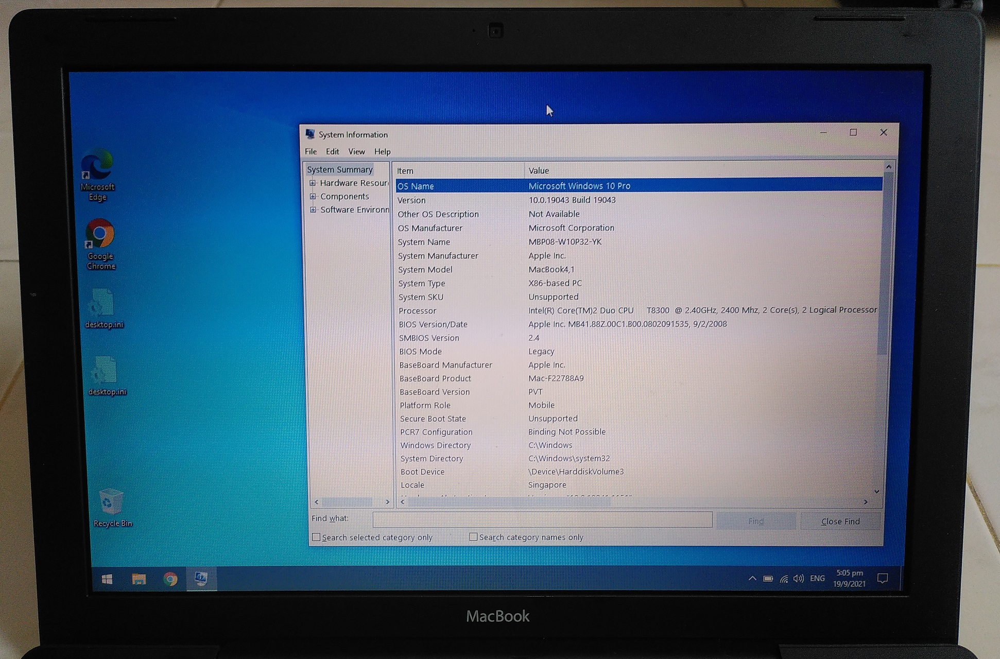

And we are done!

### Possible Issue

It seems the laptop requires a working internal battery to operate at its full potential. Without the internal battery, the CPU speed will be locked to the minimum thus impacting performance.

## Reference

Bootcamp VM setup guide: http://wheelsandbytes.github.io/comp/vbox-windows/vbox-windows.html