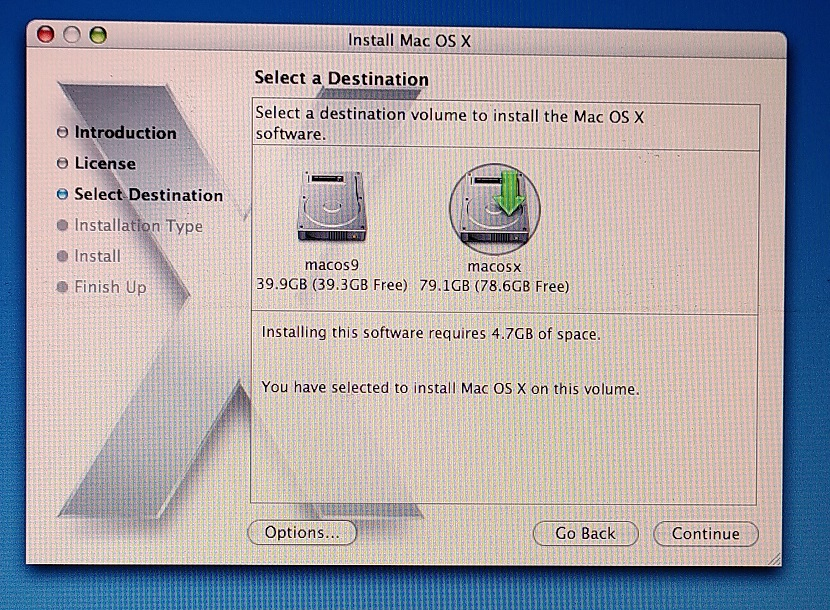
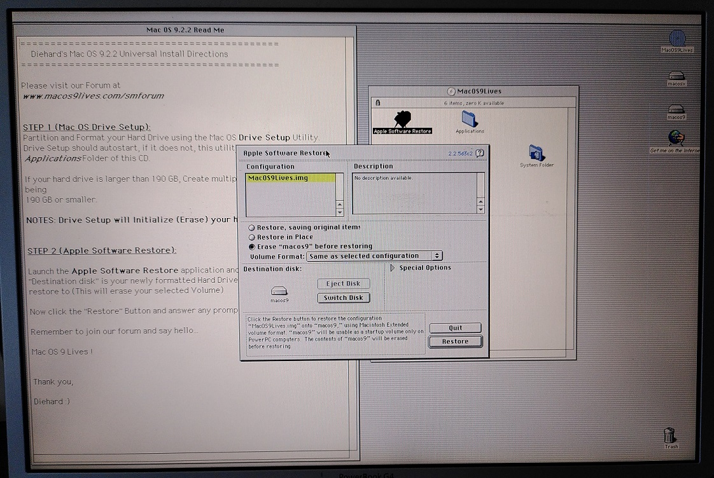
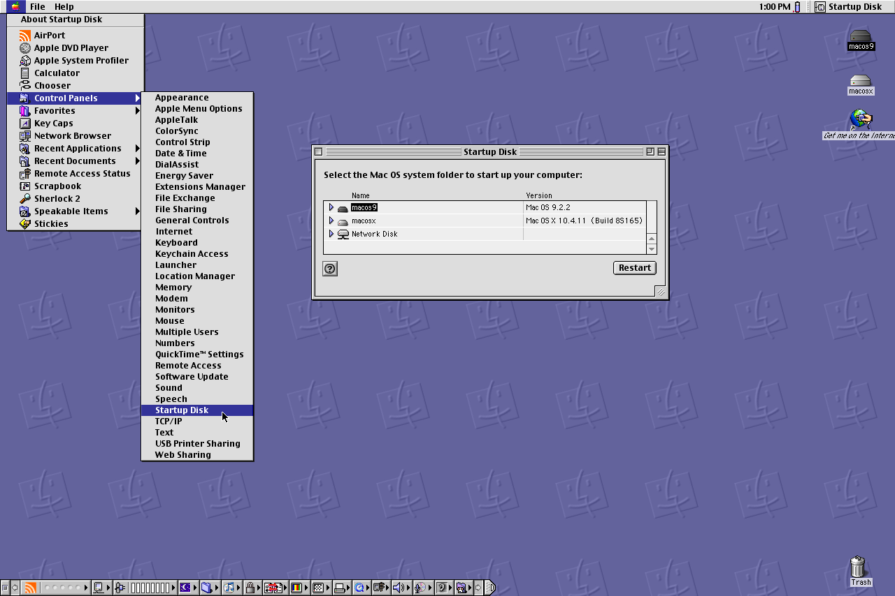

# PowerBook G4 A1025 (Titanium) (PowerBook3,5)

This laptop was released in Nov 2002 and is the last of the PowerBook G4 line that can natively boot into Mac OS 9.

This guide will be about installing both Mac OS 9.2.2 and OS X 10.4 Tiger on this system as a dual boot configuration.

## Hardware

* CPU: Single-core 1 GHz PowerPC G4
* Graphics: ATI Radeon 9000 with 64 MB of DDR SDRAM
* RAM: 1GB 2x 512MB PC-133

With OS X Tiger 10.4.

With OS 9.

### Storage Drive

Storage is provided by a 128GB Transcend MSA230S mSATA SSD.

The drive is mounted into a mSATA-IDE adapter then inserted into the laptop.

## OS Images

### Mac OS X Tiger 10.4

I used the 5-CD version this as the DVD drive on this PowerBook G4 cannot read DVD+R discs which I have. I don't have DVD-R discs to burn to.

After installation, the OS can be updated to 10.4.11 as Apple's update servers are still active.

https://macintoshgarden.org/apps/mac-osx-mac-os-10-ppc

### Mac OS 9.2.2

For the OS 9.2.2 disk, I opted to use the image from [MacOS9Lives forum](http://macos9lives.com/smforum/index.php/topic,4366.0.html) as they are ISO images and are easier to work with on modern systems.

Since this machine can natively boot into Mac OS 9, I used the [Mac OS 9.2.2 Universal Install](http://macos9lives.com/smforum/index.php/topic,2109.0.html) for the Classic Environment.

## Installation

Here are the high level steps I used to install both operating systems.

1. Boot from Tiger OS disk and partition disk
2. Complete Tiger OS installation and all updates
3. Boot from Mac OS 9 install CD and complete the installation.
5. If Classic Environment is desired, copy OS9 Systems Folder to the OS X partition and setup Classic.

### Mac OS X 10.4 Tiger

#### 1. Boot from the Tiger install CD

#### 2. Once it starts, launch Disk Utility to partition the disk.

OS9 gets the first partition of 40GB.

OSX gets the second partition of about 80GB.

Since this machine natively supports booting into OS 9, the option to install Mac OS 9 drivers is given.

#### 3. Continue with the setup utility to the end

Remember to select the correct disk.

#### 4. Install updates

You may need to run the Software Update tool a few times to finish updating all software.

Here is a fully updated OS X 10.4.11 Tiger installation.

### Mac OS 9

Once OS X is installed, we can proceed directly to Mac OS 9. 

#### 1. Boot from OS 9 install CD

Boot from the `Mac OS 9.2.2 Universal Install for the Classic Environment` ISO.

Press the Option key to get to this boot menu. Select the MacOS9Lives Live CD.

Once selected, it will boot up into a LiveCD environment.

These applications should start automatically. Close the Drive Setup program as it is not needed.

#### 2. Install to the hard drive

Start Apple Software Restore from the CD.

Make sure the correct partition is selected.

#### 3. Start from the native OS 9 boot partition

OS 9 booting up

Reached the retro desktop!

## Switching operating systems

### Reboot to OS X from OS 9

Go to Apple Menu -> Control Panels -> Startup disk

Select the Mac OSX disk to boot from.

### Reboot to OS 9 from OS X

Go to System Preferences -> Startup Disk

Since this machine can officially boot to OS 9, OS 9 partition is available as a boot option.

### On machine start

One can press the Option key immediately on machine start.

The boot menu will show the available boot options.

### Mac OS 9 Classic Environment in OS X

The Mac OS 9 System and Application folders have to be copied from the `Mac OS 9.2.2 Universal Install` ISO's internal restore image file `MacOS9Lives.img` to any place of your choosing.

Here it shows the depth of files needed to be open.

After that run the `Classic` applet from `System Preferences`. Configure the applet to the location of the OS 9 system files then start it.