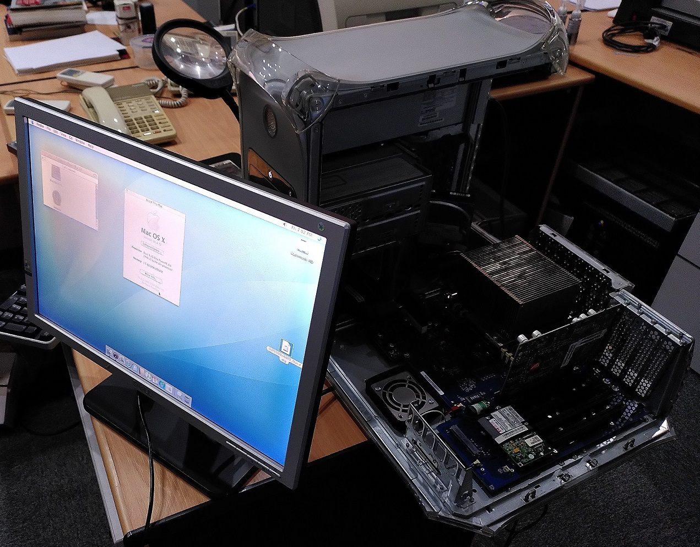
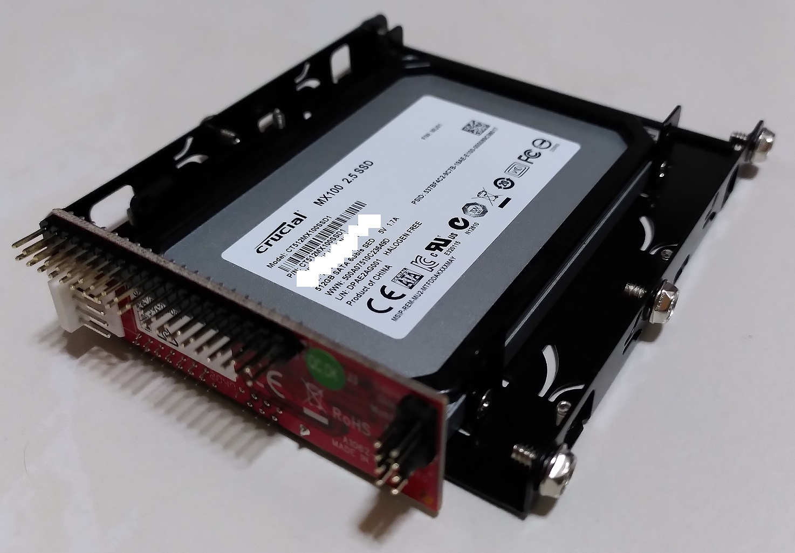

# Power Mac G4 (Mirrored Drive Doors FW800)

This is a desktop Mac released in 2003. This model is unfortunately the first one of this series that cannot boot natively into the Mac OS 9. 

If OS 9 has to be used, it can only be officially done though the Classic environment abstraction layer.

However native OS 9.2.2 booting can still be done with some workarounds.

This guide will be about installing both Mac OS 9.2.2 and OS X 10.4 Tiger on this system as a dual boot configuration.

## Hardware



The system can easily be open without any screws. Just pull the latch the case will open.

### CPU


The CPU is a dual-core 1.25 GHz PowerPC G4. It is below the large passive heatsink. 

### Graphics card


An AGP ATI Radeon 9000 Pro with 64 MB VRAM with DVI and [ADC](https://en.wikipedia.org/wiki/Apple_Display_Connector) ports powers the graphics portion.

Notice the card has an extra tab beside the AGP slot. It is for the card to draw extra power to supply to an external ADC monitor.

I tried newer AGP 8x cards on this system but it does not work by default. According to [Wikipedia](https://en.wikipedia.org/wiki/Apple_Display_Connector#Pin_3_and_11), this is because some pins which are not used by AGP 4x are used by the system to send power for the external ADC monitor. These pins are now used in AGP 8x hence are not compatible.

### Storage Drive



Storage is provided by a 512GB Crucial MX100 SATA SSD. 2.5" form factor is converted to 3.5" by a mounting bracket.

The SATA interface is converted to IDE via a [Startech SATA to IDE adapter](https://www.startech.com/en-sg/hdd/ide2sat2).


The drive and adapter is then mounted onto a vertical drive cage.

### RAM


2GB RAM is provided by 4 sticks of 512MB PC-2700 DDR SDRAM

### Slots


The system has 4x 64-bit PCI slots which is pretty uncommon.

I added a [Startech PCI USB 2.0 card](https://www.startech.com/en-us/cards-adapters/pciusb7) based on VIA VT6212 chipset. This card is compatible with OS X 10.4 and does not work on OS 9.2.2 as expected.

## OS Images

### Mac OS X Tiger 10.4

I opted to use the 10.4.6 DVD image over the 4-CD version to reduce the hassle of reinserting discs.

After installation, the OS can be updated to 10.4.11 as Apple's update servers are still active.

https://macintoshgarden.org/apps/mac-osx-mac-os-10-ppc

### Mac OS 9.2.2

For the OS 9.2.2 disks, I opted to use images from [MacOS9Lives forum](http://macos9lives.com/smforum/index.php/topic,4366.0.html) as they are ISO images and are easier to work with on modern systems.

* Mac OS 9.2.2 For Previously Unsupported G4s for the dual boot: http://macos9lives.com/smforum/index.php/topic,2143.0.html

* Mac OS 9.2.2 Universal Install for the Classic Environment: http://macos9lives.com/smforum/index.php/topic,2109.0.html

## Installation

Here are the high level steps I used to install both operating systems.

1. Boot from Tiger OS disk and partition disk
2. Complete Tiger OS installation and all updates
3. Mount and copy OS 9 installation to OS 9 partition and bless the drive.
4. Reboot to Mac OS 9 to complete the installation.
5. If Classic Environment is desired, copy OS9 Systems Folder to the partition and setup Classic.

Many thanks to this [forum post](http://macos9lives.com/smforum/index.php/topic,5345.msg39057.html#msg39057) as I adapted many instructions from it.

### Mac OS X 10.4 Tiger

#### 1. Boot from the Tiger install DVD

#### 2. Once it starts, launch terminal to partition the disk.


```bash
diskutil partitionDisk /dev/disk0 2 OS9Drivers HFS+ macos9 150G JHFS+ macosx 326.9G
```

This command partitions the SSD into 2 partitions the first 150GB for OS X the other 326.9GB for OS 9. 

The reason this has to be done through the Terminal is because Mac OS 9 drivers have to be installed into some partitions. The normal Disk Utility app will not do this for a system that does not officially support native booting into Mac OS 9.

#### 3. Continue with the setup utility to the end


Remember to select the correct disk.

#### 4. Install updates


You may need to run the Software Update tool a few times to finish updating all software.


Here is a fully updated OS X 10.4.11 Tiger installation.

### Mac OS 9

Once OS X is installed, we can proceed directly to Mac OS 9. 

#### 1. Copy System files to OS9 partition

The Mac OS 9 System and Application folders have to be copied from the `Mac OS 9.2.2 For Previously Unsupported G4s` ISO's internal restore image file `MacOS9LivesMR.img` to the OS 9 partition.


Mount the successive images bit by bit then copy into the partition.

You may need to run Finder as Administrator in order to copy the files into the OS 9 partition.

```bash
sudo /System/Library/CoreServices/Finder.app/Contents/MacOS/Finder
```

#### 2. Bless the OS 9 partition

Now we have to `bless` the partition to make it bootable. Open the Terminal and run:

```bash
sudo bless -folder9 /Volumes/macos9/System\ Folder -use9 -bootBlockFile /usr/share/misc/bootblockdata
```
#### 3. Boot into the OS 9 partition

In order to complete the installation, we have to reboot into OS9 and complete the remaining setup steps.

```bash
sudo bless -folder9 /Volumes/macos9/System\ Folder --setBoot
sudo reboot
```

After rebooting, complete the registration. The system did hang for me here after the registration window. I just did a hard reset of the system.


If all goes well, you will get the retro Classic desktop!

#### 4. Reboot back into Mac OS X 10.4 Tiger

Go to Apple Menu -> Control Panels -> Startup disk


Select the disk to boot from. This technique will be subsequently used to switch to Tiger after booting to OS 9.

### Mac OS 9 Classic Environment in OS X

The Mac OS 9 System and Application folders have to be copied from the `Mac OS 9.2.2 Universal Install` ISO's internal restore image file `MacOS9Lives.img` to any place of your choosing.

After that run the `Classic` applet from `System Preferences`.


Configure the applet to the location of the OS 9 system files then start it.

### Mac OS X System optimisation

Not directly related to this guide but could be tangentially relevant.

1. Show hidden files in Finder

```bash
defaults write com.apple.Finder AppleShowAllFiles true
killall Finder
```

2. Install the last versions of some apps for Tiger OS

* [TenFourFox](https://www.floodgap.com/software/tenfourfox/): One of the last updated browsers for OS 10.4
* [Iterm1](http://iterm.sourceforge.net/): To replace the default Terminal
* [VLC 0.9.10](https://www.videolan.org/vlc/download-macosx.html): Media player
* [iStat Menus](https://macintoshgarden.org/apps/istat-menus): Display live system stats

## Possible Issues

### Black screen on boot

During my installation attempts, I encountered several times the system fails to start. After the power button is pressed, the startup chime is heard then nothing else.

The NVRAM may be corrupted and a reset may be necessary.

[Source](https://www.sweetwater.com/sweetcare/articles/how-to-reset-pram-or-nvram/)

1. Power off your Mac.
2. Press your Mac’s power button and then hold these four keys at the same time: ⌘ + option + P + R.
3. Continue holding the keys until your Mac restarts for the second time. The chime will sound upon restart.

After this, the system will boot from the first bootable partition which is OS 9 in my case.

### OS X cannot reboot to OS 9


As this machine does not officially support native OS 9 booting, no option is given to reboot to the OS 9 partition even if all files are there.

Use the bless command mentioned previously to force the boot from OS9 partition.

```bash
sudo bless -folder9 /Volumes/macos9/System\ Folder --setBoot
sudo reboot
```

For convenience, this can be placed into a shell script.

### Cannot enter Open Firmware

Open Firmware can be thought as of something like a command-line based bootloader or BIOS which allows you to issue boot commands before system start.


It is normally entered by pressing ⌘ + option + O + F on start. On my system, it is exceedingly difficult for me to enter this mode for some reason.

If this mode can be entered, the OS can be selected on start using the `multi-boot` command.

### Potential overheating with case open

The heat sink for the CPU is passive hence it relies on another fan attached to another part of the case below the external CD drive for airflow.


When the case is fully closed, this is not a problem. However when the system is on and the case is open in this photo, there is no airflow to push the hot air away.

The fan will be driven to very high speed with no avail. One has to be careful not to leave the system in this open state for too long.

### Fan noise in OS 9

Fan noise is extremely loud when my system is in OS9. Unsure whether the fan speed is the cause or symptom (high temperature).

I'm just tolerating this problem for now.